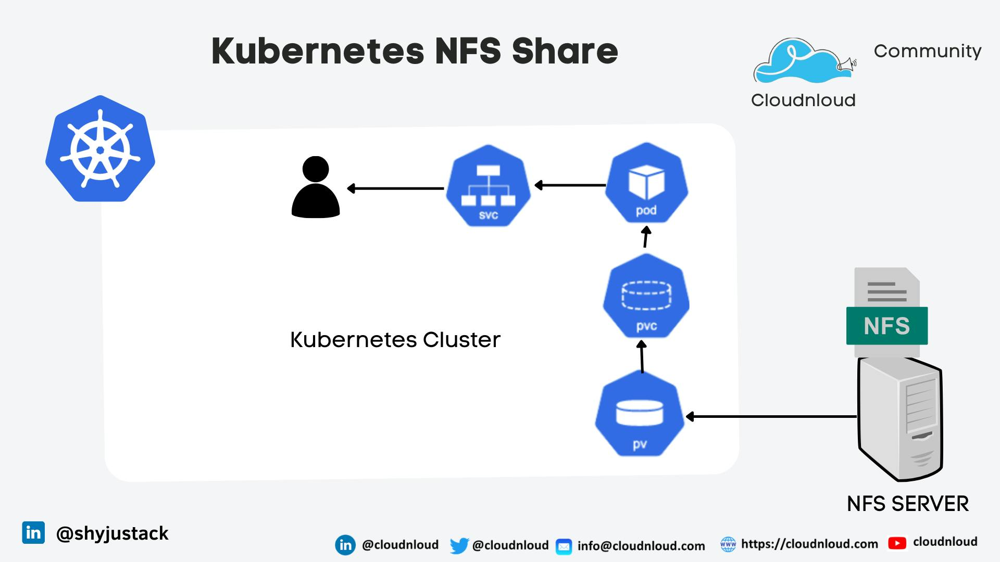

# Automated NFS Configuration for Kubernetes Persistent Volumes using Ansible

This project provides a fully automated solution to configure Network File System (NFS) on a set of Ubuntu servers and integrates it with Kubernetes for Persistent Volumes (PV). The automation is driven by Ansible, ensuring a consistent and repeatable setup across multiple servers.



### Step 1: Clone the Repository

To begin, clone this repository to your local machine:

```bash
git clone https://github.com/siavashmhi/Kubenfs.git
cd Kubenfs
```

### Step 2: Modify ansible inventory.ini file

You have to set server IPs in this file.

```bash
cat inventory/inventory.ini 

[all]
nfs-server ansible_host=192.168.1.10
worker1 ansible_host=192.168.1.11
worker2 ansible_host=192.168.1.12

[nfs-servers]
nfs-server ansible_host=192.168.1.10

[kubernetes-workers]
worker1 ansible_host=192.168.1.11
worker2 ansible_host=192.168.1.12

```

### Step 3: Run nfs.yml ansible playbook.

```bash
ansible-playbook -i inventory/inventory.ini playbooks/nfs.yml
```
